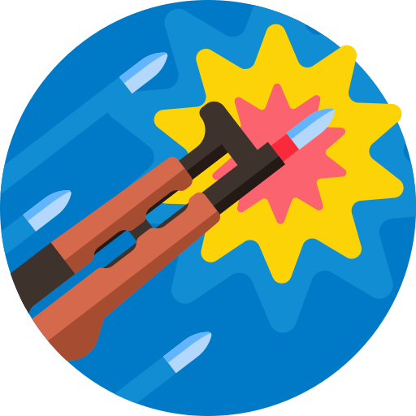

<p align="center">

</p>
<h1 align="center">AKM Remix</h1>

[](https://vercel.com/new/git/external?repository-url=https://github.com/iffa/next-starter)

Find affordable games and downloadable content from dozens of stores with zero hassle.

## Built with

- [Remix](https://remix.run/)
- [Tailwind CSS](tailwindcss.com/) for styling
- One-click deploy to [Vercel](https://vercel.com)

## Getting Started

```bash
git clone git@github.com:iffa/akm-remix.git

cd akm-remix

npm install

# create .env. and add environment variables (see .env.example)
touch .env

npm run dev
```

Open [http://localhost:3000](http://localhost:3000) with your browser to see the result.

## Credits

Products and search powered by [Allkeyshop.com](allkeyshop.com/).

Favicon made by <a href="https://www.freepik.com" title="Freepik">Freepik</a> from <a href="https://www.flaticon.com/" title="Flaticon">www.flaticon.com</a>.
